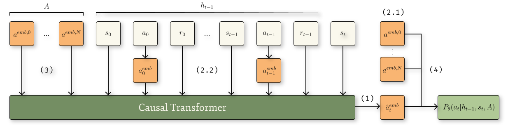

<h1 align="center">Headless-AD</h1>

This repository contains an official implementation of [Headless-AD](https://arxiv.org/pdf/2312.13327.pdf).  

TL;DR: we extend [Algorithm Distillation](https://arxiv.org/pdf/2210.14215.pdf) to environments with variable discrete action spaces.



# Dependencies
To install project dependencies, execute 
```
pip3 install -r requirements.txt
```

We also use the [tiny_llama](https://github.com/jzhang38/TinyLlama). Follow their installation process at the [link](https://github.com/jzhang38/TinyLlama/blob/main/PRETRAIN.md).

## Docker
We prepared a Dockerfile for an easier setup of the working environment.
```
docker build . -t headless_ad
docker run --itd --rm --gpus all -v $(pwd):/workspace/files --name headless_ad headless_ad
```

# Project Structure
**Environments.** We conduct the experiments on three environments - Bernoulli Bandit, Contextual Bandit, and Darkroom. Their definitions can be found in the `envs` directory.

**Training and Data Generation.** `src` directory contains subdirectories with training codes for each respective environment. `<env_name>/algorithms` contain training code for AD and Headless-AD. `<env_name>/common` contain the code that is used by both models such as data generation algorithms `generate.py`, dataset class `data.py`, and the generation of environments' parametrizations `prepare_envs.py`.

**Model Definition.** Additionally, you can find the models' definitions in `<env_name>/common/ad_transformer.py` and `<env_name>/common/transformer.py` for AD and Headless-AD respectively. They are based on tiny_llama's code and both use the components defined in `src/tiny_llama` which is just a copy-paste of tiny_llama's repository with some minor changes. Thanks to `tiny_llama` contributors for their invaluable work!

**Random Action Embeddings.** One of the key components of Headless-AD's framework, the mapping of action indices to random embeddings, is located in `src/action_mapper.py`.

**Hyperparameter Tuning.** We performed a hyperparameter tuning for each (environment, model) pair for a fair comparison between the models. You can find sweep definitions in the `sweeps/tune/<env_name>/` directory.

**Configs.** We've put the best hyperparameters obtained as the result of the sweep in `configs/` directory. Then we run both models on several different seeds to suggest more reliable results. We use sweeps defined in `sweeps/optimal/<env_name>/` to go over each seed.

# Running the models
To run the models with mixed precision training you should have the `accelerate` package installed (see Dependencies). For example, if you have A100 GPU, run
```
accelerate launch --mixed_precision bf16 -m src.bandit.algorithms.headless_ad
```

`bf16` is not available on other GPUs, so either use `fp16` or run without `accelerate` for full-precision training:
```
python3 -m src.bandit.algorithms.headless_ad
```

# Report Generation
To reproduce the figures from the paper, use should run two scripts:
* `src/paper_utils/make_plots.py` generates all the figures with comparisons of the models in different settings. The images can be found in `reports/plots/` directory.
* `src/paper_utils/hypers_csvs.py` processes the config files in the `configs/` directory and puts them into csvs for later use as tables with hyperparameters in our paper. The resulting csvs can be found in `reports/hypers/` directory.

# Citing
If you use this code for your research, please consider the following BibTeX:

```
@article{sinii2023context,
  title={In-Context Reinforcement Learning for Variable Action Spaces},
  author={Sinii, Viacheslav and Nikulin, Alexander and Kurenkov, Vladislav and Zisman, Ilya and Kolesnikov, Sergey},
  journal={arXiv preprint arXiv:2312.13327},
  year={2023}
}
```
